# Lesson: Digital Storytelling

### First and Last Name: Daniele Charasanakis
### University Registration Number: dpsd18129
### GitHub Personal Profile: DaniXks
### Digital-Storytelling-Individual-Assignment: xxx

# Introduction
Hi, here I'm planning to make a short animation for the Digital-Storytelling lesson at my university.
The subject is probably going to be a car chase.

# 1st Deliverable
This is the 1st deliverable. Nothing special so far, just followed the tutorials, made a few customizations and added some animated cameras to create the dailys you will find in the folders.

For Unit 2 I created these simple custom buildings with "ProBuilder" in Unity:
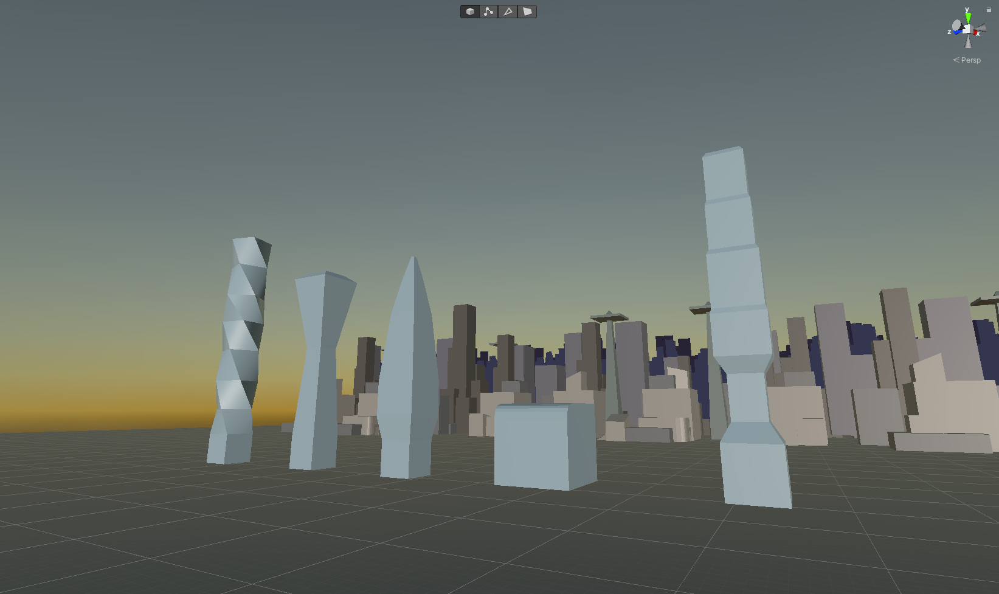

For Unit 3, this is the traffic cone I modeled:
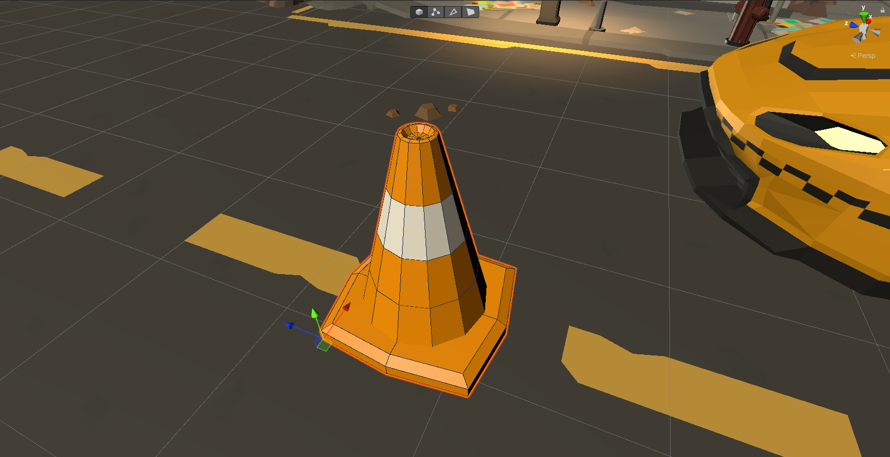

And here is a car model I modeled in Blender that will replace the taxi in the future:
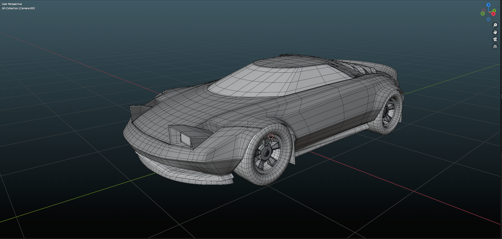
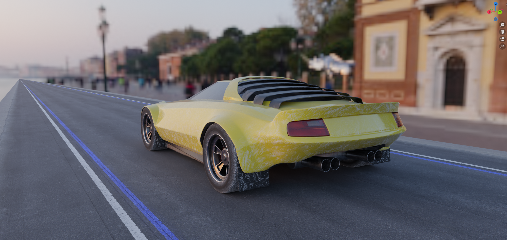

For Unit 4, there are two dailies you can check. One is this one, with pedestrians.
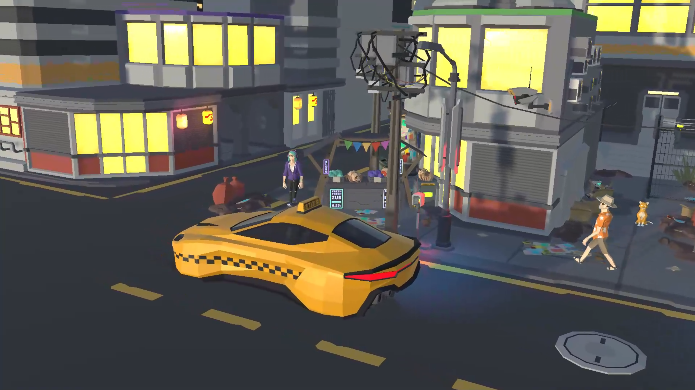

And then the other one is this one where I tried to make a cool shot of the taxi for the last challenge.
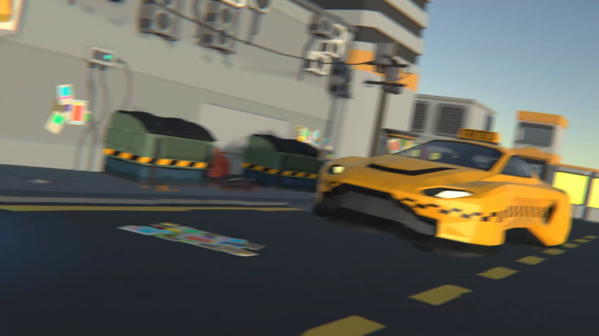

The camera and car animation especially required a lot of work so that they came out smooth, with extra attention paid to the angle of the tangents on each keyframe.
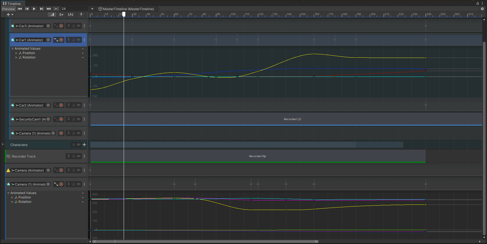

This is all for now.

# 2nd Deliverable

Time to step up my game and move entirely to Blender. And Gaea.
And use some of my music again.

I updated the car textures to match the environment. So I added dust and dirt. Then changed the colour to a dark blue.
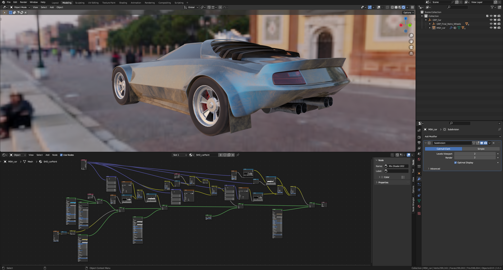

Then I created a new desert environment inside a software for generating environments called "Gaea".
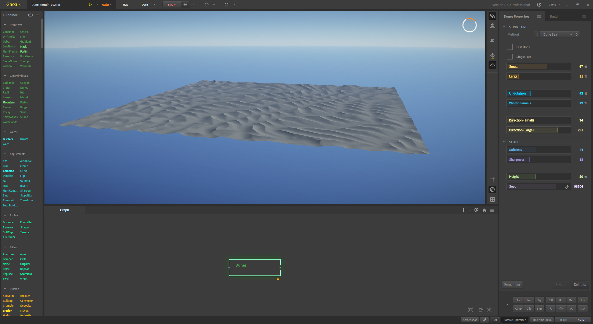

Exported it into a "16bit Tiff" and used the texture to displace a plane with the Displace modifier inside Blender.
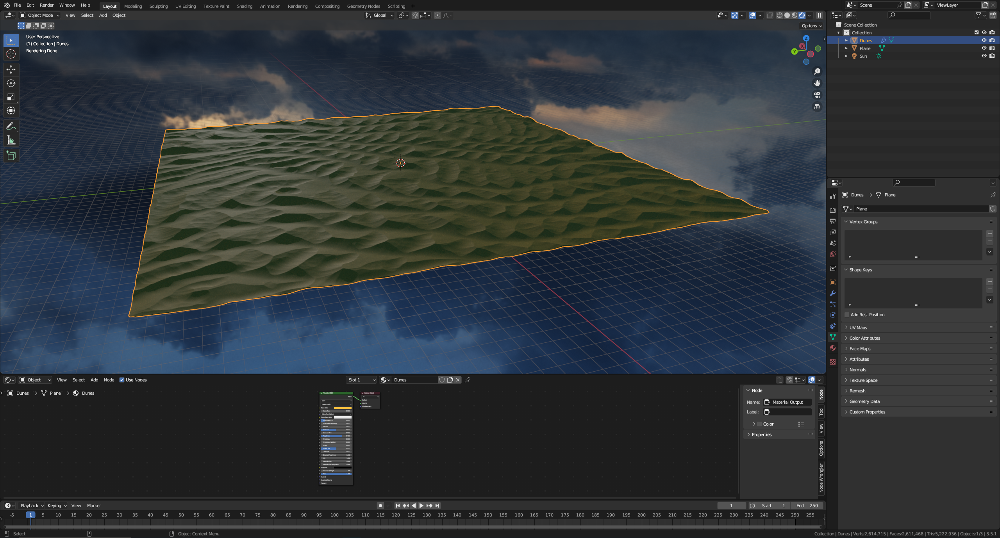

Then created a highway with an array modifier, applied a highway texture, and flattened the dunes so that the road can pass through them.
Also applied a sky texture to light up everything in a cinematic way, with the sun close to the horizon.
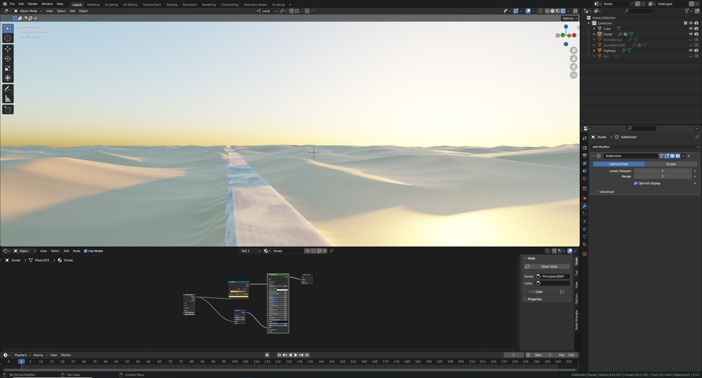

Then added 2 skyscrapers, using a model I had modelled earlier, and damaged them a little by deleting a few pieces and bending others. Also added some dust.

Finally, imported the car model and did the most time consuming thing in this project which was...its animation.
The cameras and cars are all meticulously animated manually (if we ignore the noise/waves I used to make the smallest shakes for the wheels and the tiny camera shake for some shots).
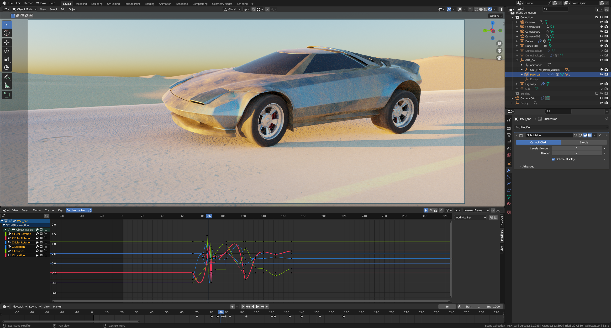

For the fourth shot, when the car enters the frame, I simulated some smoke.
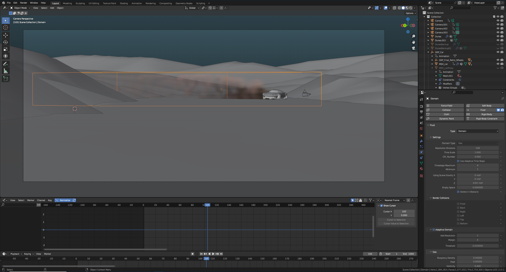

For the rendering I used the 2.37:1 ratio for a widescreen cinematic feel, with a resolution of 1920 x 810.
I used Cycles for maximum realism and tried to optimize it as much as I could to improve rendering times. No frame took more than 15 seconds to render in this video, some took only 4.

Some shots are rendered with only 64 samples, others with 128. Some have denoising, some don't.
Lastly, I used DaVinci Resolve to assemble and edit all the rendered shots and color-correct everything. I also added the animated titles in the intro.
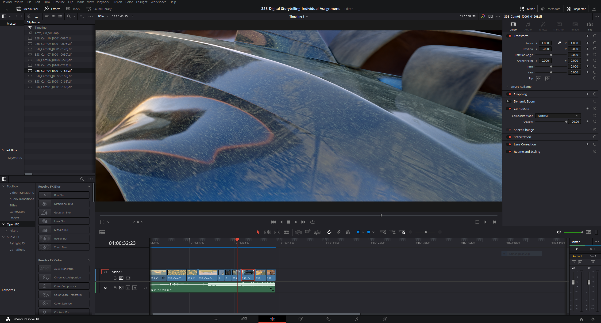

Here is a comparison.
This is a rendered frame straight out of Blender:
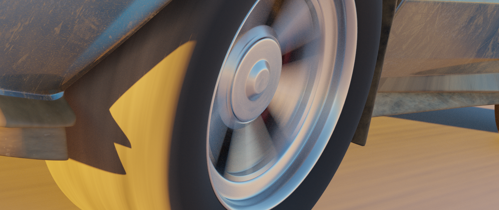

This is the same frame but color-corrected:
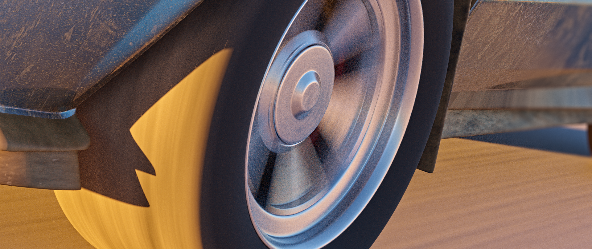

Lastly, the music was composed by me using FL Studio :)

Here is the final version! (for now) 

Enjoy!

https://user-images.githubusercontent.com/65423916/236704392-576b6455-d3d4-4b79-8861-3982f56410ef.mp4

Here is a YouTube link for better quality: https://www.youtube.com/watch?v=9yS4FdB8w9E

# 3rd Deliverable

# Conclusions

# Sources
